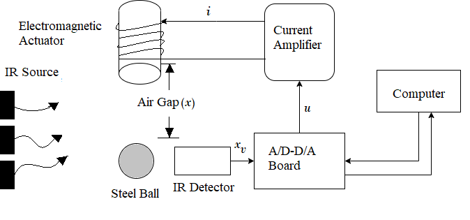

## Introduction

<b>Discipline | <b> Electrical Engineering 
:--|:--|
<b> Lab | <b> **Control and Instrumentation Lab**
<b> Experiment|     <b> **Study and operation of Magnetic Levitation and Experiment 2**

### About the Experiment 
**System description**

The magnetic levitation (MAGLEV) is a non-contact technology . It reduces the cost of maintenance as there is no friction and so the energy	efficiency is high. This technology is the future in transportation, non-contact actuators, precision engineering, non contact structures,satellite launching, etc. However, the open loop MAGLEV system is highly nonlinear and highly unstable and therefore, designing a simple and effective controller for such a system is very challenging.
					

<b>Name of Developer | <b> **Prof. Alok Kanti Deb**
:--|:--|
<b> Institute | <b>  **Indian Institute of Technology Kharagpur**
<b> Email id|     <b>  **alokkanti@ee.iitkgp.ac.in**
<b> Department |  **Department of Electrical Engineering**
<b>Webpage| <b> http://www.iitkgp.ac.in/department/EE/faculty/ee-alokkanti

### Contributors List

SrNo | Name | VLabs Developer or Integration Engineer | Designation | Department| Institute
:--|:--|:--|:--|:--|:--|
1 | **Piyali Chattopadhyay** | Developer & Integration | Project Scientist | Department of Electrical Engineering | IIT Kharagpur | 
