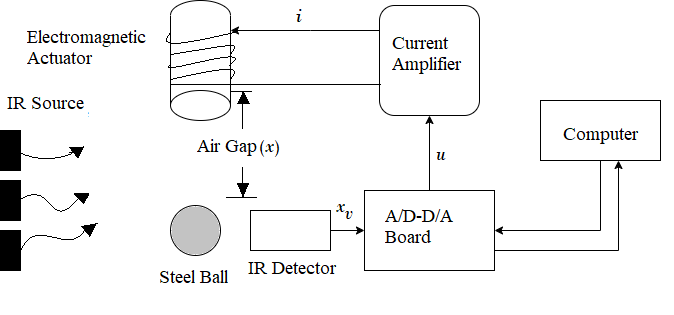
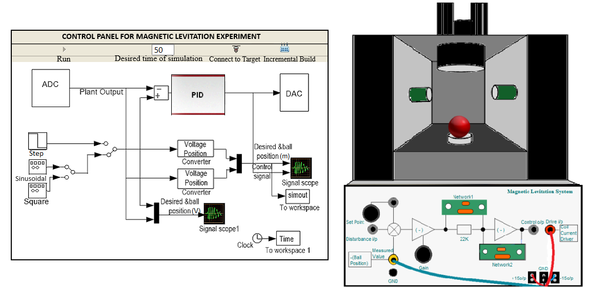
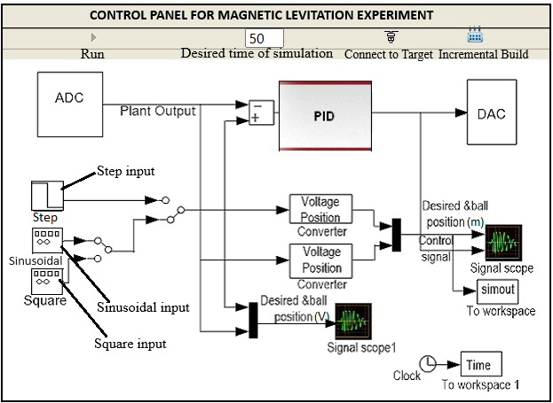

### Procedure

 
<b>Fig. 1. Schematic of the MAGLEV system</b>

							

 
<b>Fig. 2. Experimental setup for magnetic levitation control simulation</b>

							
								
**Steps to perform the simulation**

1. The control panel consists of three input signals 'Step', 'Sinusoidal' and 'Square'. After clicking on any input, input parameter box will appear.
The parameter values can be changed. Click on 'Ok' button. Set the desired time for the experiment by changing the value of the corresponding input box (just beside the 'Connect to Target' icon).
						  

						  
 
<b>Fig. 3. MAGLEV Controller</b>

							
2. Click on 'Incremental Build' icon in the control panel . Wait till the MAGLEV model is successfully built and an alert message is shown.
						  
3. Click on 'Connect to Target' icon in the control panel (the icon after triangular button ('Run')). Wait for the triangular button ('Run') to get enabled, then click on it.
						  
4. Drag the red ball to exactly between the IR sensors (green boxes) and put there. Click on the 'Signal scope' or 'Signal scope 1' icon to observe individual response in meter and volt respectively.
The response for corresponding input will be shown during levitation of the ball, the red curve shows the input signal and the black curve shows the output signal in the plot. After the given time the ball will fall down.
		  
5. Click on 'Download Plot' button to download it. Click on 'Ok' button above the plot to restart the experiment with different input signal following the steps (1-4).
							
  
