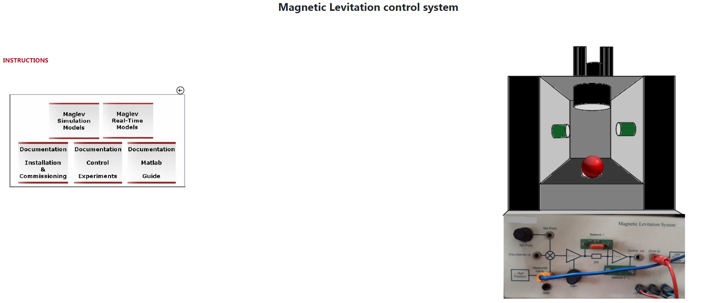
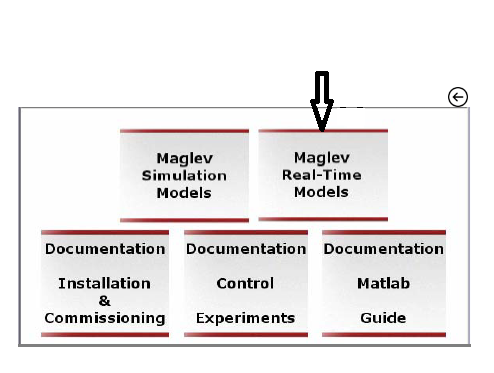
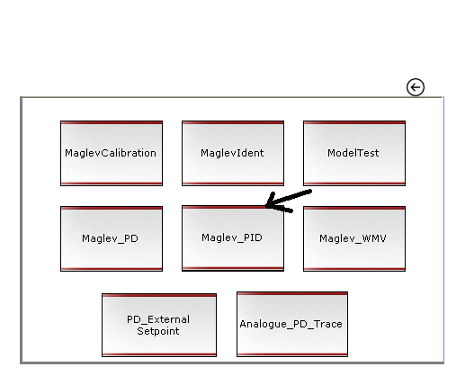
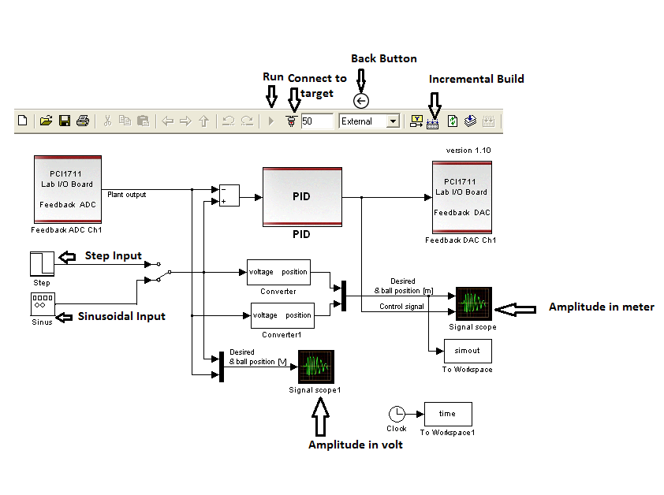

### Procedure
 

 
								

[Fig 2: Experimental set-up for Magnetic Levitation Control simulation]

<b>Steps to perform the simuation</b> 
								
  <ol type="1">
  <li> Click on 'Maglev Real-Time Models' tab in the left section box. One dialogbox will be opened. </li> 
   
  
  <li> Click on 'maglev_PID'.Total control structure is given there. </li> 
   
  
  <li>Three inputs are there ,Step,Sinusoidal and Square.Click on individual inputs to observe individual response.  </li> 
   
  
  <li>Click on 'Incremental Build' in the box (the second icon after External is written).Wait till one alert message comes.</li> 
  
  <li>Click on 'Connect to Target' in the box (The icon after trianguler button).Wait for the trianguler button(Run) to become black ,then click on it.</li>   
  
  <li>Drag the red ball to exactly between the IR sensors and put there.Click on the signal scope or signal scope 1 icon to observe individual response in meter and volt respectively.
  The response for corresponding input will be shown during levitation of the ball, the yellow curve depicts input signal where as the blue curve depicts the output signal.After a certain time it will fall down.</li>  
  
  <li>Click on the backward arrow sign above the left hand side dialogbox to restart the experiment with different input signal.</li> 

  </ol>	    
								

							
            
