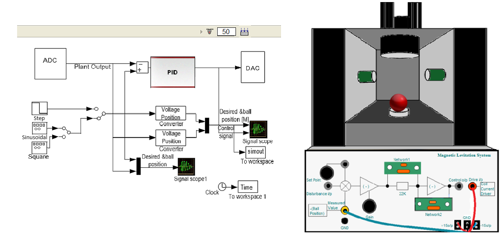

### Procedure

							

[Fig 2: Experimental set-up for Magnetic Levitation Control simulation]

								
								
**Steps to perform the simulation**

1. The control panel consists of three input signals step, sinusoidal and square. After clicking on any input, input parameter box will appear.The parameter values can be changed except the square wave input. In square wave input parameter box, the frequency is kept fixed at 0.04 Hz to show exact two cycles of it. Click on 'Ok' button. Set the desired time for the experiment by changing the value of the corresponding input box.
(just beside the 'Connect to Target' button).
						  

						  

							
2. Click on 'Incremental Build' in the control panel . Wait till the MAGLEV model is successfully built and an alert message comes.
						  
3. Click on 'Connect to Target' in the control panel (The icon after triangular button(Run)). Wait for the triangular button(Run) to become black ,then click on it.  
						  
4. Drag the red ball to exactly between the IR sensors (green boxes) and put there. Click on the 'signal scope' or 'signal scope 1' icon to observe individual response in meter and volt respectively.The response for corresponding input will be shown during levitation of the ball, the red curve shows the input signal and the black curve shows the output signal. After the given time the ball will fall down. 
						  
5. Click on 'Ok' button above the plot to restart the experiment with different input signal following the steps (1-4).
							
  