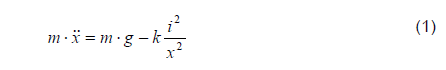
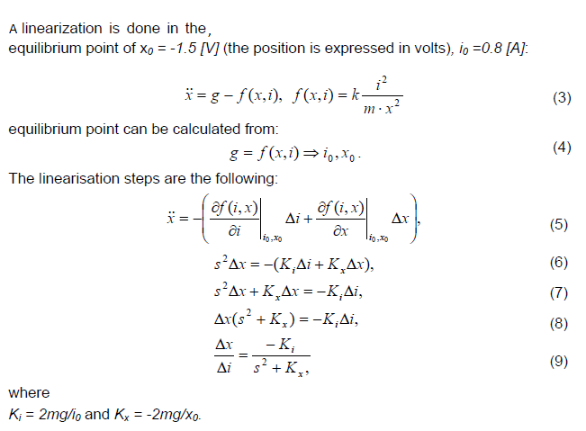
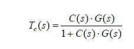
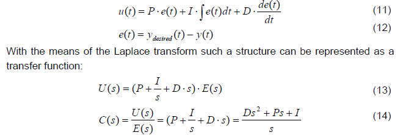

### Theory
<b>MAGLEV:</b>
                           The magneticlevitation(MAGLEV)is a non-contacttechnology.it reduces the cost of maintenance as there is no friction and so the energy efficiency is high.This technology is the future in
                            transportation,non-contact actuators,precision engineering,non-contact structures,satellitelaunching,etc. 
							 							
							Magnetic levitation system (MLS) is an electromagnetic device which levitates ferromagnetic elements using principle of electromagnetism. MLS technology eliminates mechanical contacts between moving and stationary
                             parts thereby reducing the friction. Due to reduction in friction, MLS offers many advantages such as low noise,ability to do work in high vacuum environment, high precision positioning platforms. MLS generally works on
                             three kinds of forces namely propulsion, levitation and guidance force. Propulsion force to push moving part forward, levitation force to lift up the moving part, and guidance force to avoid derailing. If magnetic force is
                             attractive then it is magnetic suspension while repulsive force responsible for magnetic levitation. MLS has numerous applications like ability to do work in high vacuum environment . But due to the
                             constant need of levitation, a MLS is subjected to continuously changing parameters and hence the mathematical model is highly nonlinear. There have been several attempts to model and control the MLS . Despite the fact
                             that magnetic levitation is non linear behaviour and it is described by non linear differential equation, mostly design approaches are based on linear model.
								  								
								<b>DYNAMIC MODELLING OF A MLS</b>  
								MLS considered for modeling consists of a ferromagnetic ball suspended in a voltage controlled magnetic field. Ferromagnetic core coil acts as actuator, sensor determining the position of ball with respect to core coil,
                                ferromagnetic ball has single degree of freedom. Fig. 1 shows the schematic diagram of the studied MLS which consists of magnetic levitation mechanical unit (electromagnet, sensors, and ferromagnetic ball) with a computer
                                interface card, a signal conditioning unit, connecting cables. There are two inputs to the system - Reference input signals u and i.
								Magnetic levitation system modeling is based on model linearization using Taylor’s series. 								
								The simplest non linear model of MAGLEV relating the ball position and coil current i is: 
								  								
								where k is a constant depending on the coil (electromagnet) parameters. To present the full phenomenological model a relation between the control voltage u and 
								the coil current would have to be introduced analysing the whole Maglev circuitry. However Maglev is equipped with an inner control loop providing
								a current proportional to the control voltage that is generated for control purpose:i = k1 * u .(2) Equations (1) and (2) constitute a nonlinear model,
								which has been assembled in Simulink.The bound for the control signal is set to [-5V .. +5V].Maglev is a SISO plant – single input single output (Figure 2).
								Position is the model output and voltage is the control signal.  
								  								
								 								
								<b>Plant Control:</b> 
								A general schematic of a simple control closed loop system is presented below.  
								 							
								Assuming that the plant is represented by its linear model its transfer function can be described as:  
                                 G(s) = B(s)/A(s)  								 
                                where s is the Laplace operator. The idea of control algorithms is to find such a controller (transfer function, discrete transfer function, any nonlinear), 
								which will fulfil our requirements (certain dynamic response, certain frequency damping, good response to the dynamic changes of the desired value etc.).
								Every controller’s input is the e(t) error signal. Sometimes disturbance signals are also measured. Depending on the present and past values of the error signal, 
								the controller performs such an action (changes the u(t) control signal) that the y(t) is as close to the ydesired(t) value as possible at all times.
								There are a lot of controller design and tuning methods. All of them consider the behaviour of the ‘closed loop system’ and provide controller parameters according to 
								the assumed system characteristics. With the known plant transfer function G(s) it is possible to find satisfactory parameters of the C(s) controller such that 
								the closed loop system will have the desired characteristics described by the transfer function Tc(s):  
                                   
                                <b>PID Controller</b>  
								A PID controller consists of 3 blocks: Proportional, Integral and Derivative. The equation governing the PID controller is as follows:   
                                   
								 Each of the PID controller blocks (P, I and D) plays an important role. However for some applications, the Integral or Derivative part has to be excluded to give
								 satisfactory results. The Proportional block is mostly responsible for the speed of the system reaction. However for oscillatory plants it might increase
								 the oscillations if the value of P is set to be too large.The Integral part is very important and assures zero error value in the steady state,
								 which means that the output will be exactly what we want it to be. Nevertheless the Integral action of the controller causes the system to respond slower to
								 the desired value changes.
								 The Derivative part has been introduced to make the response faster. However it is very sensitive to noise and may cause the system to react very nervously.
								 Thus very often it is omitted in the controller design. Derivative part output filtering may reduce the nervous reaction but also slows the response of 
								 the controller down and sometimes undermines the sense of using the Derivative part at all. Proper filtering can help to reduce the high frequency noise
								 without degrading the control system performance in the lower frequency band.		
							    
							
                       