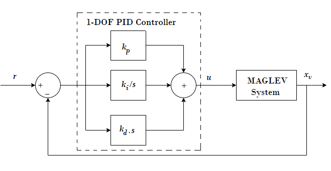

# Theory

 **MAGLEV**
								 
The magnetic levitation (MAGLEV) is a non-contact technology. It reduces the cost of maintenance as there is no friction, so the energy efficiency is high. This technology is the future in
transportation, non-contact actuators, precision engineering, non-contact structures, satellite launching, etc.
							

 
<b>Fig. 1. MAGLEV mechanical unit</b>

							
Magnetic Levitation System (MLS) is an electromagnetic device which levitates ferromagnetic elements using principle of electromagnetism. MLS technology eliminates mechanical contacts between moving and stationary
parts thereby reducing the friction. Due to the reduction in friction, MLS offers many advantages such as low noise, ability to work in high vacuum environment, high precision positioning platforms. MLS generally works on
three kinds of forces namely propulsion, levitation and guidance force. Propulsion force is to push the moving part forward, levitation force is to lift up the moving part, and guidance force is to avoid derailing. 
The repulsive force is responsible for magnetic levitation. MLS has numerous applications like ability to work in high vacuum environment but due to the
constant need of levitation, MLS is subjected to continuously changing parameters and hence the mathematical model is highly nonlinear. There have been several attempts to model and control the MLS . Though the magnetic levitation is having non linear behavior and it is described by non linear differential equation, mostly design approaches are based on linear model.
															
								
**Dynamic modeling of a magnetic levitation system (MLS)**
								
MLS consists of a ferromagnetic ball , suspended in a voltage controlled magnetic field. Ferromagnetic core coil acts as an actuator, sensor determines the position of the ball with respect to the core coil.
Fig. 1 shows the schematic diagram of the studied MLS which consists of magnetic levitation mechanical unit (electromagnet, sensors, and ferromagnetic ball) with a computer
interface card, a signal conditioning unit, connecting cables. There are two inputs to the system - reference input signal u and coil current i.
Magnetic levitation system modeling is based on model linearization using Taylor’s series.

The simplest non linear model of MAGLEV relating the ball position x and coil current i is :

$$m . \ddot{x} = m . g - k \frac{i^2}{x^2} \tag 1$$
								
where k is a constant depending on the coil (electromagnet) parameters, g is the acceleration due to gravity.
To present the full phenomenological model a relation between the control voltage u and 
the coil current i would have to be introduced analysing the whole MAGLEV circuitry. However MAGLEV is equipped with an inner control loop providing
a current proportional to the control voltage that is generated for control purpose:

$$i = k_1 . u \tag 2$$

Equations (1) and (2) constitute a nonlinear model.
k1 is control voltage to coil current gain.
The bound for the control signal is set to (-5V to +5V). 

	
<b>Fig. 2. MAGLEV model for position control</b>

 

MAGLEV is a SISO plant – single input single output (Fig. 2).
Ball Position is the model output and voltage is the control signal.

As the system dynamics is nonlinear, for analysis and controller design purpose it is linearized around an equilibrium point 
x0, i0. At this point we consider 
$$\ddot{x} = 0$$
								
Hence,
$$k = \frac{mgx_0^2}{i_0^2} \tag 3$$

Equation (1) can be written as,

$$\ddot{x_0} = g - f(i,x), \ f(i,x) = k \frac{i^2}{m.x^2} \tag 4$$

At equilibrium point,

$$g = f(i,x) \tag 5$$

For linearization purpose let,

$$x = x_0 + \Delta x$$

$$i = i_0 + \Delta i$$
								
where &Delta;x is the small deviation from the equilibrium position 
x0 and &Delta;i is the small deviation from the equilibrium coil current
i0.

A linearization is done at the equilibrium point of 
x0 = -1.5 V (the position is expressed in volts), 
i0 = 0.8 A

The linearization steps are the following:

$$\ddot{x} = -(\frac{\delta f(i,x)}{\delta i} \vert_{i_0,x_0} \Delta i + \frac{\delta f(i,x)}{\delta x} |_{i_0,x_0} \Delta x ), \tag 6$$

$$s^2\Delta x = -( k_i \Delta i -k_x \Delta x ),$$

$$s^2\Delta x - k_x \Delta x = - k_i \Delta i,$$

$$\Delta x( s^2 - k_x ) = - k_i \Delta i,$$

$$\frac{\Delta x}{\Delta i} = \frac{-k_i}{ s^2 - k_x } \tag 7$$

where,

$$k_i = \frac{2g}{i_0}$$

$$k_x = \frac{2g}{x_0}$$
								
Coil current i proportional to the control voltage 
u, i.e. i = k1 . u, 
k1 being the proportionality constant.
The transfer function becomes,

$$\frac{\Delta x}{\Delta u} = \frac{-k_1 k_i}{ s^2 - k_x } \tag 8$$

where &Delta;u is the incremental control voltage from its equilibrium value. Finally, considering the (IR) sensor is
linear with gain k2, the overall plant transfer function can be written as,

$$P(s) \triangleq \frac{\Delta x_v}{\Delta u} = \frac{-k_1 k_2 k_i}{ s^2 - k_x } \tag 9$$

where xv is the sensor output (in volt). Note from the expression of
ki and
kx that this linearized system is independent of levitation-ball mass.
The parameters of the physical system considered are presented in list below. With these parameters, the plant transfer function becomes

$$P(s) \triangleq \frac{b}{s^2 - p^2} = \frac{-3518.85}{s^2 - 2180} \tag {10} $$

The open-loop system is highly unstable, the poles are located at ±46.69.

<b>The physical MAGLEV system parameters :</b>

m — Mass of the steel ball 0.02 kg

<i style="font-family:'Times New Roman'"><b>g</b></i> — Acceleration due to gravity 9.81 m/s2

i0 — Equilibrium value of current 0.8 A

x0 — Equilibrium value of position 0.009 m

k1 — Control voltage to coil current gain 1.05 A/V

k2 — Sensor gain, offset (&eta;) 143.48 V/m, -2.8 V

Control input voltage level (u) &plusmn; 5 V

Sensor output voltage level (xv) +1.25 V to -3.75 V

**Plant Control**
								
A general schematic of a simple control closed loop system is presented in Fig. 3.  

 
<b>Fig. 3. Simple control system - closed loop</b>

 
								
								
Assuming that the plant is represented by its linear model its transfer function can be described as: 
 
$$G(s) = \frac{B(s)}{A(s)}$$
								 
where s is the laplace operator. The idea of control algorithms is to find such a controller (transfer function, discrete transfer function, any nonlinear), 
which will fulfill our requirements (certain dynamic response, certain frequency of damping, good response to the dynamic changes of the desired value etc.).
Every controller’s input is the e(t) error signal. Sometimes disturbance signals are also measured. Depending on the present and past values of the error signal, 
the controller performs such an action (changes the u(t) control signal) that the y(t) is as close to the
ydesired (t) value as possible at all times.
There are a lot of controller design and tuning methods. All of them consider the behavior of the closed loop system and provide controller parameters according to 
the assumed system characteristics. With the known plant transfer function G(s) it is possible to find satisfactory parameters of the C(s) controller such that 
the closed loop system will have the desired characteristics described by the transfer function Tc(s) :  

$$T_c(s) = \frac{C(s). G(s)}{1 + C(s) . G(s)} \tag{11}$$
 
 
**PID Controller**
								
A PID controller consists of 3 blocks: Proportional, Integral and Derivative. The equation governing the PID controller is as follows :  
								
$$u(t) = k_p. e(t) + k_i.\int{e(t)}dt + k_d \frac{de(t)}{dt} \tag{12}$$

$$e(t) = y_{desired}(t) - y(t) \tag{13}$$

With the means of laplace transform such a structure can be represented as a transfer function: 

$$U(s) = ( k_p + \frac{k_i}{s} + k_d.s ). E(s) \tag{14}$$

$$C(s) = \frac{U(s)}{E(s)} = (k_p +\frac{k_i}{s} + k_d.s) = \frac{k_ds^2 + k_ps + k_i}{s} \tag{15}$$		
								

 
<b>Fig. 4. 1 DOF PID controller</b>

Each of the PID controller blocks (kp, ki/s  and 
kd.s) plays an important role. The proportional block is mostly responsible for the speed of the system reaction. However for oscillatory plants it might increase
the oscillations if the value of kp is set to be too large. The integral part is very important and assures zero error value in the steady state,
which means that the output will be exactly what we want it to be. Nevertheless the integral action of the controller causes the system to respond slower to
the desired value changes. 

The derivative part has been introduced to make the response faster. However it is very sensitive to noise and may cause the system to react very nervously.
Thus very often it is omitted in the controller design. Derivative part output filtering may reduce the nervous reaction but also slows the response of 
the controller down. Proper filtering can help to reduce the high frequency noise without degrading the control system performance in the lower frequency band.

<link rel="stylesheet" type="text/css" href="./simulation/css/MAGLEV.css">						
								
