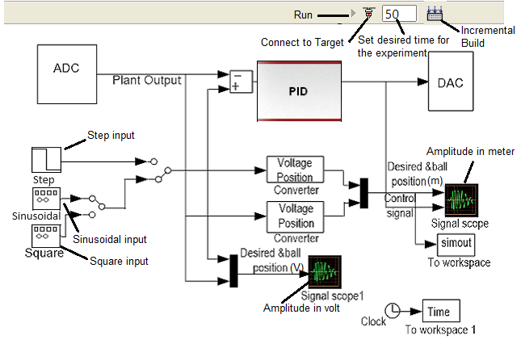

### Procedure

 
<b>Fig. 1. Schematic of the Magnetic Levitation (MAGLEV) system</b>

  

 
<b>Fig. 2. Experimental setup for Magnetic Levitation control simulation</b>

  

<b>Steps to perform the simulation</b> 
<ol type="1">

<li><ul><li>The control panel consists of three input signals 'Step', 'Sinusoidal' and 'Square'.</li>
<li>After clicking on any input, input parameter box will appear. The parameter values can be changed maintaining the following ranges.</li>
<li><b>Step :</b> 1 &le; Step size &le; 5, 1 &le; Step time &le; 25. <b>Sinusoidal :</b> 1 &le; Amplitude &le; 5, 0.1 &le; Frequency &le; 1, <b>Square :</b> 1 &le; Amplitude &le; 5, 0.01 &le; Frequency &le; 0.1.</li>
<li>Click on 'Ok' button in the input parameter box after changing the parameters. Set the desired time for the experiment simulation by changing the value of the corresponding input box
(just beside the 'Connect to Target' icon). 10 &le; Desired time of simulation &le; 50.</li>
<li>The experiment is done for fixed controller values. These can be seen by clicking on PID block in the control panel. Click on 'Ok' button in it.</li> 
</ul></li> 

						  
 
<b>Fig. 3. Magnetic Levitation (MAGLEV) control panel in simulation</b>

 

        
<li>Click on 'Incremental Build' icon in the control panel . Wait till the MAGLEV model is successfully built and an alert message is shown.</li> 

<li>Click on 'Connect to Target' icon in the control panel. Wait for the 'Run' icon to get enabled, then click on it.</li>  

<li><ul><li>Drag the red ball to exactly between the IR sensors (green boxes) and put there.</li>
<li>The response for corresponding input will be shown during levitation of the ball, the red curve shows the input signal and the black curve shows the output signal in the plot.</li>
<li>After the given time the ball will fall down.</li></ul></li>  

<li> Click on 'Download Plot' button to download plots. Click on 'Ok' button below the plot to restart the experiment with different input signal following the steps (1-4).</li> 

</ol>

